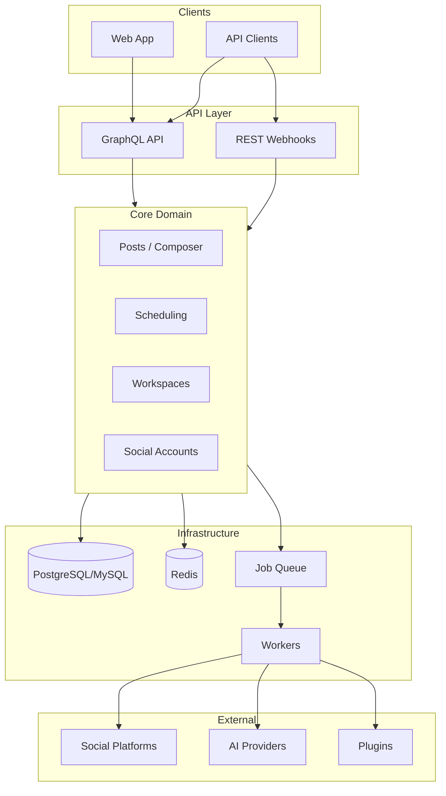

# PostForge Architecture

## High-level overview

## Principles

- **API-first:** GraphQL as primary API; REST for webhooks
- **Domain boundaries:** Posts, workspaces, social accounts, scheduling as clear domains
- **Queue-driven:** Publishing and AI run via job queue and workers
- **Plugin/integration layer:** Social adapters and AI providers behind interfaces

The backend follows **Clean Architecture** (see [post-forge-back-end/README.md](../post-forge-back-end/README.md)) with strict separation: GraphQL layer delegates to Use Cases; domain entities and interfaces in the core; infrastructure (repos, external APIs) depends on the domain, not the reverse.

## Database models (suggested)

- **users:** id, email, password_hash, name, avatar_url, email_verified_at, created_at, updated_at
- **workspaces:** id, name, slug, logo_url, owner_id (FK users), created_at, updated_at
- **workspace_members:** workspace_id, user_id, role (owner/admin/member), created_at
- **social_accounts:** id, workspace_id, user_id, platform, platform_user_id, access_token (encrypted), refresh_token, token_expires_at, metadata (JSON), created_at, updated_at
- **posts:** id, workspace_id, created_by, content (JSON), status, scheduled_at, published_at, created_at, updated_at
- **post_destinations:** post_id, social_account_id, status, published_at, external_id, error_message (nullable)

## AI generation

- **Provider abstraction:** Interface (e.g. `AIGenerateContent`) with `generate(prompt, options) -> generated_text`; one implementation per provider (OpenAI, Anthropic, etc.).
- **Bring-your-own-key:** Encrypted API keys per workspace (or user); keys stay on backend; frontend only triggers generation and receives result.
- **Flow:** Composer calls mutation `generatePostContent(prompt, provider, options)`; backend loads key, calls provider, returns content.

## Social platform integrations

- **Adapter pattern:** One interface per operation (e.g. `PublishPost`, `GetProfile`, `RefreshToken`); per-platform implementations handle OAuth and API differences.
- **OAuth:** Central flow; tokens stored in `social_accounts`; refresh in worker or on-demand before publish.
- **Publishing:** Worker loads post and destinations, calls adapter `publish(post, account)`, updates `post_destinations` and post status; idempotency and retries per destination.

## Background workers

- **Scheduler:** Cron or Laravel Scheduler every minute: find posts with `status = scheduled` and `scheduled_at <= now()`, enqueue `PublishPost` job per post (or per destination).
- **Worker:** Horizon (or queue worker) runs `PublishPost`: lock post, call social adapters, persist results, release lock. Redis for idempotency keys if needed.
- **Scale:** Horizontal workers; single scheduler (or leader-elected); run state in DB to avoid duplicate publish.

## Plugin system (v2)

- Plugins are packages (Composer/npm) declaring capabilities (e.g. social adapter, AI provider, webhook handler); backend registers them at boot from config or discovery.
- Core defines interfaces (e.g. `SocialAdapter`, `AIGenerator`); plugins implement and register. No arbitrary code execution.
- Enable/disable per workspace or globally via config or DB.
